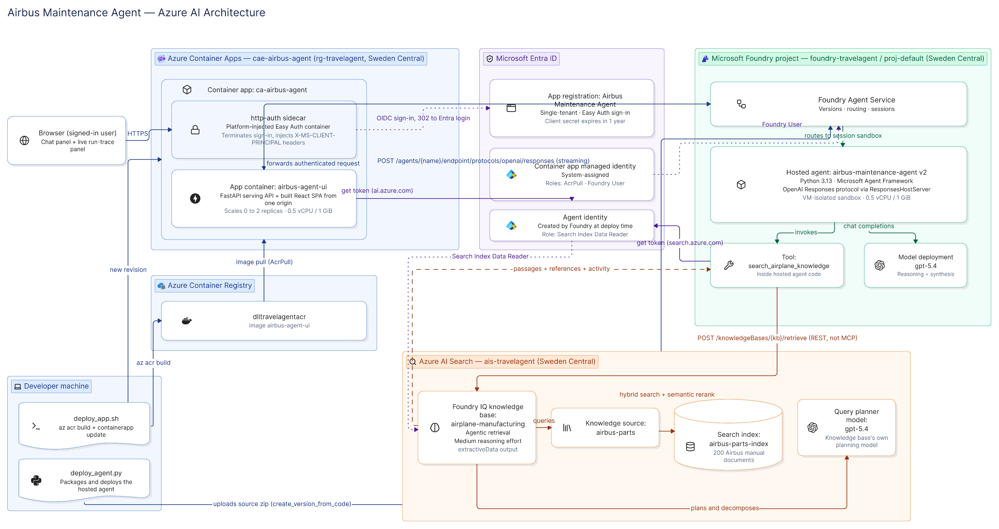
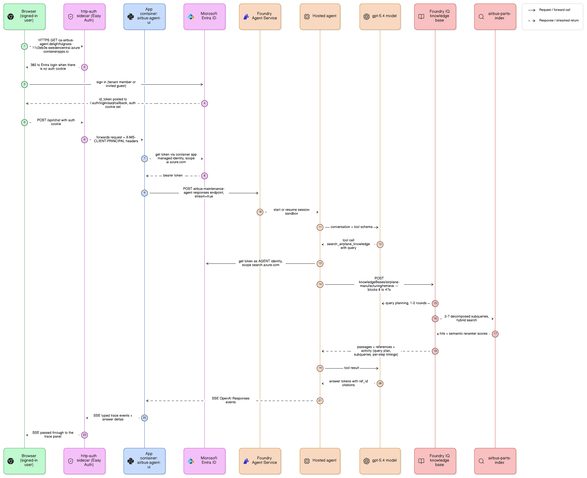

# Foundry IQ hosted agent, with its retrieval traced

A [Microsoft Foundry **hosted agent**](https://learn.microsoft.com/azure/foundry/agents/concepts/hosted-agents)
— your own Python code running on Foundry-managed compute — answering questions from a
**Foundry IQ** knowledge base, plus a chat UI that shows what the retrieval engine
actually did on every turn.

The sample corpus is a set of Airbus A320 maintenance manuals, but nothing in the code
is specific to aircraft: point it at any Foundry IQ knowledge base and it works.



*Architecture of the published app — [open in Eraser](https://app.eraser.io/workspace/4HNKHHTGXuHrFCdht5sp)*



*One question end to end, including Entra sign-in — [open in Eraser](https://app.eraser.io/workspace/P2gwW03Pkgs3LgpNYs56)*

## Presenting this code

[`docs/presenter-sheet.html`](docs/presenter-sheet.html) walks through the source in
speaking order — demo, the hosted agent, the Foundry IQ connection, deployment, and
tracing — with real excerpts, the lines to point at, and a talking point for each.
The published app also serves it at `/presenter-sheet.html`, behind the same
sign-in. On GitHub the file shows as source; clone the repo and open it in a
browser to read it locally.

## What the trace panel shows

Most RAG demos show you an answer and a list of citations. Agentic retrieval does much
more than one search, and this shows all of it, live, as it happens:

- the exact query the model chose to send to the knowledge base
- each **query planning** step — model, input/output tokens, latency (there are usually
  two: the planner re-plans after seeing the first round of results)
- every **subquery** the knowledge base decomposed the question into, verbatim, with its
  hit count and latency
- **agentic reasoning** tokens and the configured effort levels
- the **retrieved documents** with their semantic reranker scores
- token usage and wall-clock for the whole run

Every card has a `raw` disclosure with the underlying JSON.

## Why REST `/retrieve` and not the knowledge base's MCP endpoint

There are two supported ways to query a Foundry IQ knowledge base. Probed against a real
one, they return different amounts of detail:

| | MCP `knowledge_base_retrieve` | REST `/retrieve` |
| --- | --- | --- |
| Passages + references | yes | yes |
| Query plan, decomposed subqueries, per-step latency | **no** | **yes** (`activity`) |
| Extra wiring | Foundry Toolbox + `RemoteTool` connection | none |

Seeing the internals is the point here, so the agent calls `/retrieve` from inside its
own tool and forwards the `activity` array to the UI. That also removes the toolbox,
the project connection and the `azd` extension the MCP route would need.

If you don't care about traces, the MCP route is less code — see
[Connect agents to Foundry IQ knowledge bases](https://learn.microsoft.com/azure/foundry/agents/how-to/foundry-iq-connect).

---

# Fresh setup

From nothing to a published, sign-in-protected app. Steps 1–5 get it running locally;
6–8 publish it.

## 0. Prerequisites

| Tool | Why |
| --- | --- |
| [Azure CLI](https://learn.microsoft.com/cli/azure/install-azure-cli) 2.80+, signed in (`az login`) | everything |
| Python 3.13 | the agent runtime must match the hosted runtime (`python_3_13`) |
| Node 20+ | building the React UI |

In Azure you need:

- A subscription where you can **create role assignments** (Owner or User Access
  Administrator). Several steps grant roles to managed identities.
- Permission to **create Entra app registrations**, for the sign-in step.

Check both quickly:

```bash
az account show --query "{sub:name, tenant:tenantId}" -o json
az ad app list --show-mine --query "length(@)" -o tsv   # any number = you can read/create apps
```

## 1. Azure resources

You need three things. Create them in a **region that supports hosted agents** —
Sweden Central, East US 2, West Europe and [many others](https://learn.microsoft.com/azure/foundry/agents/concepts/hosted-agents#region-availability).

```bash
RG=rg-foundry-agent
LOC=swedencentral
az group create -n $RG -l $LOC -o none
```

**a) A Microsoft Foundry project with a chat model.** Create it in the
[Foundry portal](https://ai.azure.com) (*Create project*), then deploy a chat model such
as `gpt-5.4`. Hub-based projects are not supported — the project must live under a
`Microsoft.CognitiveServices/accounts` resource. Note the project endpoint from the
project's Overview page; it looks like
`https://<account>.services.ai.azure.com/api/projects/<project>`.

**b) An Azure AI Search service** with AAD authentication enabled:

```bash
az search service create -n <search-service> -g $RG -l $LOC \
  --sku standard --auth-options aadOrApiKey --aad-auth-failure-mode http401WithBearerChallenge
```

> `--auth-options aadOrApiKey` matters. A service left on `apiKeyOnly` will reject the
> agent's managed identity with a 403 and no useful error.

**c) A container registry**, for publishing later:

```bash
az acr create -n <container-registry> -g $RG --sku Basic -o none
```

## 2. A Foundry IQ knowledge base

This is the one step with no CLI. In the [Foundry portal](https://ai.azure.com) go to
**Knowledge** and create a **knowledge source** over your documents (a blob container or
uploaded files), then a **knowledge base** that uses it. Microsoft's walkthrough:
[Create a knowledge base](https://learn.microsoft.com/azure/search/agentic-retrieval-how-to-create-knowledge-base).

Two settings shape what this app can show you:

| Setting | Use | Why |
| --- | --- | --- |
| Output mode | `extractiveData` | returns passages for your agent to synthesise, rather than pre-writing the answer. The citations in the UI depend on it. |
| Retrieval reasoning effort | `medium` | `low` plans fewer subqueries, so the trace has less to show; `high` is slower again. |

Confirm it works before going further — this returns the passages *and* the `activity`
array the trace panel renders:

```bash
KEY=$(az search admin-key show --service-name <search-service> -g $RG --query primaryKey -o tsv)
curl -s -X POST -H "api-key: $KEY" -H "Content-Type: application/json" \
  "https://<search-service>.search.windows.net/knowledgeBases/<kb>/retrieve?api-version=2026-08-01-preview" \
  -d '{"messages":[{"role":"user","content":[{"type":"text","text":"<a question your documents answer>"}]}]}' \
  | python3 -m json.tool | head -40
```

If `references` is empty, the agent has nothing to work with and nothing later will fix
that. Sort out the knowledge source first.

## 3. Configure

```bash
cp .env.example .env
```

Fill in every value. `.env` is gitignored. Values containing spaces must be quoted — the
shell scripts source this file.

## 4. Install

```bash
python3.13 -m venv .venv && source .venv/bin/activate
pip install -r agent/requirements.txt -r backend/requirements.txt -r deploy/requirements.txt
(cd web && npm install)
```

## 5. Run it locally

Three terminals. The agent's own server first:

```bash
source .venv/bin/activate && cd agent && python main.py     # :8088
```

Then the backend, pointed at it:

```bash
source .venv/bin/activate
LOCAL_AGENT_URL=http://localhost:8088 uvicorn app:app --app-dir backend --port 8000
```

Then the UI:

```bash
cd web && npm run dev                                        # :5173
```

Open <http://localhost:5173>. The header pill reads `local`. Ask something your documents
answer and watch the trace panel fill in.

> Retrieval is slow and variable — the same question has taken 8s and 47s. That is the
> knowledge base's own agentic retrieval, not your network. The UI shows a live timer.

## 6. Deploy the agent to Foundry

```bash
source .venv/bin/activate
python deploy/deploy_agent.py
```

This zips `agent/`, uploads it, waits for the remote build, grants the agent access to
the knowledge base, routes the endpoint to the new version and runs a smoke test.

**The first run is a two-step dance and that is unavoidable.** A hosted agent gets its
own Entra identity only when it is first deployed, so it cannot be granted access before
it exists. The script assigns **Search Index Data Reader** to that identity as soon as it
appears; if you lack rights to create role assignments it prints the exact `az` command
to hand to someone who has them. Until that lands, the agent answers but every retrieval
returns 403.

Re-run this after any change to `agent/`. Each run mints a new immutable version.

## 7. Publish the app

```bash
./deploy/provision_app.sh
```

One idempotent script: creates the Container Apps environment and the container app with
a managed identity, grants it `AcrPull` and `Foundry User`, creates the Entra app
registration, and turns on built-in authentication so only signed-in users get in.
Safe to re-run — it checks before creating, so it doubles as a way to verify a
deployment still matches the script.

Then for code changes:

```bash
./deploy/deploy_app.sh
```

Check it:

```bash
FQDN=$(az containerapp show -n <containerapp-name> -g $RG --query properties.configuration.ingress.fqdn -o tsv)
curl -s -o /dev/null -w '%{http_code}\n' -A Mozilla -H 'Accept: text/html' "https://$FQDN/"   # 302 -> login
curl -s -o /dev/null -w '%{http_code}\n' -X POST "https://$FQDN/api/chat"                     # 401
```

302 for a browser and 401 for anything else means sign-in is enforced. Open the URL and
sign in.

## 8. Who can sign in, and how to add someone

**By default the app is open to everyone in your tenant.** The enterprise application is
created with *assignment required* off, so every member and guest in the directory can
sign in and use the agent. Adding a person is only a real step when they are outside the
tenant, or after you switch to the allowlist in option C.

List who that currently is:

```bash
az rest --method get \
  --url "https://graph.microsoft.com/v1.0/users?\$select=displayName,userPrincipalName,userType" \
  --query "value[].{name:displayName,upn:userPrincipalName,type:userType}" -o table
```

### A. Already in the tenant

Nothing to do. Send them the URL.

### B. Outside the tenant — invite as a guest

A B2B guest becomes a directory member for sign-in purposes, so the app needs no change.
There is no `az ad user invite` command; use the Graph invitations endpoint:

```bash
az rest --method POST \
  --url "https://graph.microsoft.com/v1.0/invitations" \
  --headers "Content-Type=application/json" \
  --body '{
    "invitedUserEmailAddress": "person@example.com",
    "invitedUserDisplayName": "Person Name",
    "inviteRedirectUrl": "https://<your-app-fqdn>/",
    "sendInvitationMessage": true
  }'
```

### C. Restrict to named people (recommended before inviting guests)

Switches from "anyone in the tenant" to an explicit allowlist. Do it **before** inviting
guests, or every guest you add gets access automatically.

```bash
APP_ID=$(az ad app list --display-name "<entra-app-name>" --query "[0].appId" -o tsv)
SP=$(az ad sp show --id "$APP_ID" --query id -o tsv)

# 1. Require assignment
az ad sp update --id "$APP_ID" --set appRoleAssignmentRequired=true

# 2. Assign a person
USER_ID=$(az ad user show --id person@example.com --query id -o tsv)
az rest --method POST \
  --url "https://graph.microsoft.com/v1.0/servicePrincipals/$SP/appRoleAssignedTo" \
  --headers "Content-Type=application/json" \
  --body "{\"principalId\":\"$USER_ID\",\"resourceId\":\"$SP\",\"appRoleId\":\"00000000-0000-0000-0000-000000000000\"}"
```

The all-zeros `appRoleId` is the default "has access" assignment used when an app defines
no roles of its own. To see or revoke access:

```bash
az rest --method get \
  --url "https://graph.microsoft.com/v1.0/servicePrincipals/$SP/appRoleAssignedTo" \
  --query "value[].{principal:principalDisplayName,type:principalType,id:id}" -o table

az rest --method DELETE \
  --url "https://graph.microsoft.com/v1.0/servicePrincipals/$SP/appRoleAssignedTo/<assignmentId>"
```

Assign a group instead of individuals by passing the group's object id — that needs
Microsoft Entra ID P1.

> Sign-in state lives in the auth cookie, so revoking access does not end a session
> already open. It takes effect at their next sign-in.

---

## How it fits together

```
Browser ──HTTPS──> http-auth sidecar ──> App container (FastAPI + React)
                          │                        │
                    Entra sign-in            managed identity
                                                   │
                                     Foundry hosted agent (your Python)
                                                   │  agent identity
                                     Foundry IQ knowledge base /retrieve
                                                   │
                                          Azure AI Search index
```

The backend serves the built React files itself, so there is one hostname, one auth
cookie and no CORS. **No Azure credential ever reaches the browser** — the container's
managed identity calls the agent server-side.

| Path | What it is |
| --- | --- |
| `agent/main.py` | agent definition, instructions, `ResponsesHostServer` |
| `agent/knowledge_base.py` | `/retrieve` client and the traced retrieval tool |
| `backend/app.py` | SSE proxy; holds the Azure credential; serves the built UI |
| `backend/trace.py` | Responses events → the UI's trace vocabulary |
| `web/src/components/TracePanel.tsx` | the run timeline |
| `deploy/deploy_agent.py` | package → deploy → grant RBAC → route → smoke test |
| `deploy/provision_app.sh` | container app, identity, roles, Entra sign-in (idempotent) |
| `deploy/deploy_app.sh` | build image → new revision |

`backend/trace.py` is the only place that knows raw OpenAI Responses shapes. Events it
doesn't recognise are forwarded as `raw` rather than dropped, so nothing goes invisible
when the preview API shifts.

## Configuration worth knowing

| Variable | Default | Why you'd change it |
| --- | --- | --- |
| `AZURE_AI_MODEL_DEPLOYMENT_NAME` | `gpt-5.4` | `gpt-4.1-mini` is much cheaper and noticeably less careful with figures |
| `KB_MAX_PASSAGES` / `KB_MAX_PASSAGE_CHARS` | `12` / `1800` | retrieved passages dominate token cost (~25 KB, ~6.5k tokens per call) |
| `KB_TIMEOUT_SECONDS` | `180` | retrieval has been observed at 47s; the ceiling is deliberately generous |
| `LOCAL_AGENT_URL` | unset | set it to target a locally running agent instead of the deployed one |

## Things that will bite you

- **Grounding is enforced by the instructions, and they matter.** An earlier version of
  this agent answered "what is the boiling point of mercury?" from the model's own
  knowledge without searching at all. The instructions in `agent/main.py` now require a
  search before any factual answer and forbid falling back on general knowledge. If you
  edit them, re-test with a question your corpus cannot answer.
- **Scale to zero.** With `minReplicas: 0` the app costs almost nothing idle, but the
  first request after ~5 minutes pays a cold start on top of already-slow retrieval. Set
  `--min-replicas 1` before a demo.
- **The agent is the expensive part**, not the hosting: each question runs a chat model
  plus 40k–250k agentic-reasoning tokens in the knowledge base.
- **The Easy Auth client secret expires in a year.** Rotate with
  `az ad app credential reset --id <appId>` then re-run `provision_app.sh`.
- **Preview surfaces.** `agent-framework-foundry-hosting` is beta and the knowledge base
  API version is preview. `deploy_agent.py` tries Responses protocol `2.0.0` and falls
  back to `1.0.0`.
- **Citations** link to the search index document URL. They need an authenticated
  request, so they won't render standalone in a browser tab — they identify the source
  chunk rather than serve it.

## Tear down

```bash
az containerapp delete -n <containerapp-name> -g $RG --yes
az containerapp env delete -n <containerapp-env> -g $RG --yes
az ad app delete --id <appId>
python -c "
from azure.ai.projects import AIProjectClient; from azure.identity import DefaultAzureCredential
import os; c=AIProjectClient(endpoint=os.environ['FOUNDRY_PROJECT_ENDPOINT'], credential=DefaultAzureCredential())
c.agents.delete(agent_name=os.environ['FOUNDRY_HOSTED_AGENT_NAME'])"
```

Or delete the whole resource group if it holds nothing else.

## License

MIT
